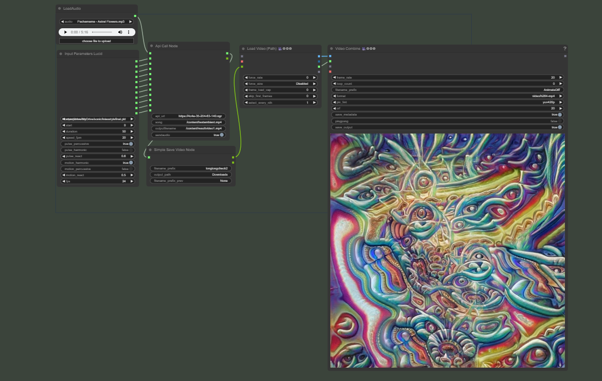
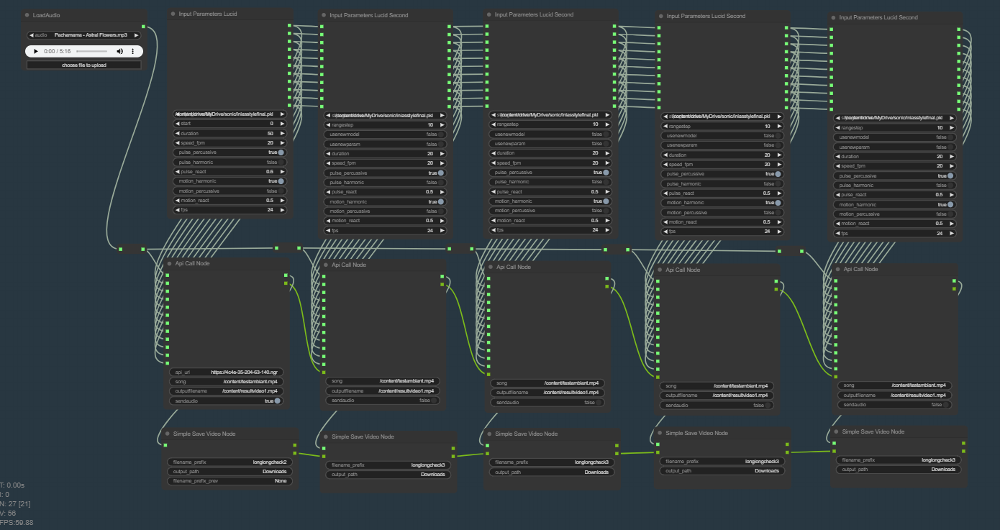
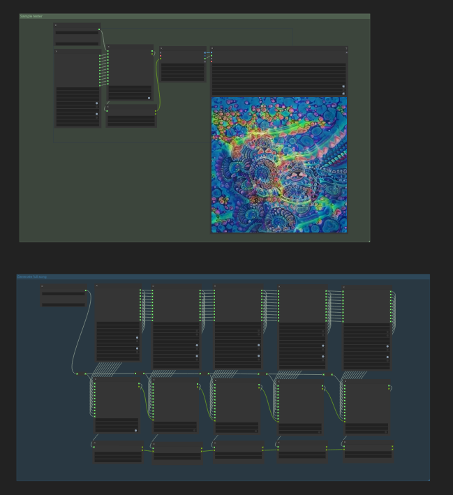

# ComfyUI-LucidSonicDreams

This project is a test and practice environment created to understand the process of developing custom nodes for [ComfyUI](https://github.com/comfyanonymous/ComfyUI) while integrating them with something I really like and that is [Lucid Sonic Dreams](https://github.com/mikael-alafriz-deel/lucid-sonic-dreams). Lucid Sonic Dreams is a tool that generates mesmerizing music videos by syncing visuals with audio, and I wanted to integrate its functionality within ComfyUI. 

## Project Overview

### Problem Statement
The Lucid Sonic Dream code I used relies on an older version of TensorFlow, which is incompatible with the newer Python version and packages required by ComfyUI. This presented a challenge that I solved by creating a Flask API. The API runs the Lucid Sonic Dreams code separately, allowing ComfyUI to interact with it via custom nodes.

### Solution
1. **Custom Google Colab Script**: 
    - A modified Google Colab script was developed to run Lucid Sonic Dreams because Colab no longer supported the older TensorFlow versions anymore. 
    - All the related and original Lucid Sonic Dreams code is located in the [lucid-sonic-dreams](https://github.com/SomersInias/ComfyUI-LucidSonicDreams/tree/main/lucid-sonic-dreams) folder.
   
2. **Flask API**: 
    - I encapsulated the working Google Colab script within a Flask API, enabling communication with ComfyUI.
    - Ngrok was used to expose the Flask API, making it accessible to the custom nodes in ComfyUI.
    - Note that for testing purpose I used a free ngrok, Do not use it in a production deployment! 
    - All the Flask API code is located in the [flask-api](https://github.com/SomersInias/ComfyUI-LucidSonicDreams/tree/main/flask-api) folder.

3. **Custom Nodes for ComfyUI**: 
    - **Initialization Node**: Initializes the parameters for the Lucid Sonic Dreams script.
    - **API Call Node**: Makes the API call to the Flask server and retrieves the video.
    - **Save Video Node**: Saves the generated video.
    - The code for these custom nodes is located in the [custom_nodes](https://github.com/SomersInias/ComfyUI-LucidSonicDreams/tree/main/custom_nodes) folder.

## How to Use

To add the custom nodes to your ComfyUI, git clone this repo and copy the [ComfyUI-LucidSonicDreams](https://github.com/SomersInias/ComfyUI-LucidSonicDreams/tree/main/custom_nodes) folder inside the custom_nodes folder into your own `custom_nodes` folder of your ComfyUI. Then, when running ComfyUI, you can load the [workflow-lucidsonicdreams.json](https://github.com/SomersInias/ComfyUI-LucidSonicDreams/blob/main/custom_nodes/workflow-lucidsonicdreams.json) workflow into ComfyUI.

The workflow includes two main groups:

1. **Quick Test Group**: This group is designed for quickly generating short video segments to experiment with different parameters. It's recommended to set the duration to a shorter time (e.g., 10-20 seconds) for faster testing.

2. **Full Song Group**: This group is intended for generating a full-length music video. Due to GPU memory limitations (CUDA out-of-memory errors), there is a limit to how long a video can be generated in a single pass. To work around this, the workflow divides the video into multiple iterations. 

   - The **step** parameter determines how many seconds of the video will overlap with the previous segment. This overlap is crucial for manually creating smooth transitions between different sections of the video.

Before running the workflow, you need to set up the API:

1. Load the [lucidsonicdreams_flaskapi.ipynb](https://github.com/SomersInias/ComfyUI-LucidSonicDreams/blob/main/flask-api/lucidsonicdreams_flaskapi.ipynb) Jupyter notebook file in Google Colab and run all the cells. (you will need to create a free ngrok account first and use your own ngrok token)
2. Once the API is running, copy the API URL into the string input of the custom API call node. The API URL will look something like this: `https://da59-35-203-186-24.ngrok-free.app`.
3. Load a song into ComfyUI using the "Load Audio" node, and you're ready to go!

Feel free to experiment with all the different parameters inside the nodes.

#### Showcase
Here are some screenshots and videos of the workflow working within ComfyUI (note that this setup also utilizes three other custom nodes from the ComfyUI community):

#### Group 1 of workflow

#### Group 2 of workflow generating full song

#### Full workflow 

#### Video showcase result

#### Video generating video sample (note this video is fast forward, long videos take couple of minutes to generate)

